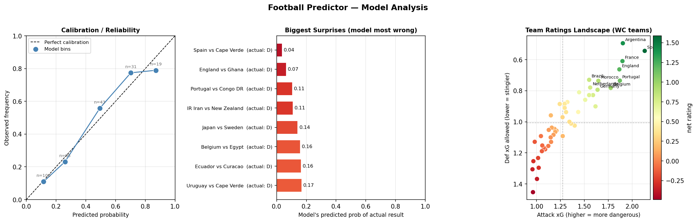
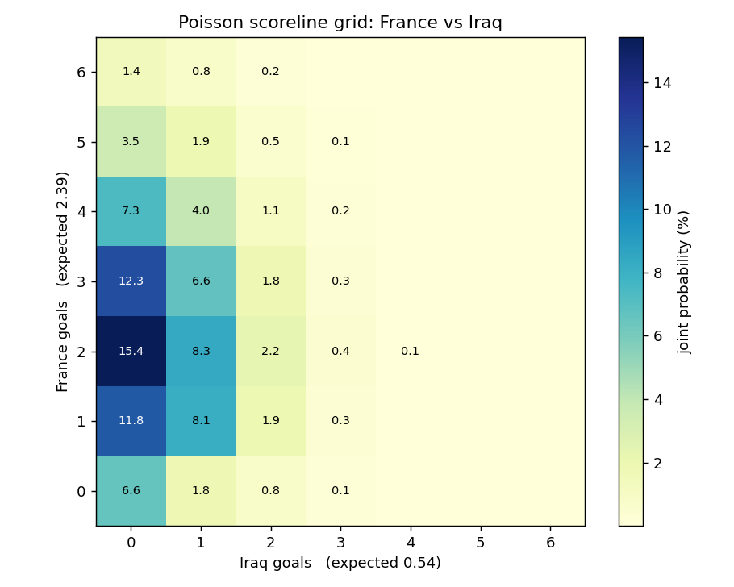

# Football Match Prediction Model

[](https://github.com/JKemay/world-cup-2026-predictor/actions/workflows/ci.yml)
[](https://world-cup-2026-ml.streamlit.app)

[](LICENSE)

A World Cup 2026 match predictor that **improves on a hand-tuned reference model by
*fitting* its parameters from event data** instead of guessing them. Validated not
just by cross-validation but by **predicting all 24 real 2026 World Cup knockout
matches out-of-sample before they were played**: 79% top-1 accuracy, +45% RPS vs a
naive baseline.

**Live demo:** [world-cup-2026-ml.streamlit.app](https://world-cup-2026-ml.streamlit.app)

**Pipeline:** Sportradar event data → xG (from shot coordinates) → Dixon-Coles
attack/defense ratings (FIFA-anchored) → Poisson scoreline grid.

## Table of Contents

- [Status](#status)
- [Results](#results)
- [Out-of-sample validation](#out-of-sample-validation-knockout-stage)
- [Run](#run)
- [Dashboard](#dashboard)
- [How it improves on the reference model](#how-it-improves-on-the-reference-model)
- [Data](#data)
- [Example](#example)

See also: [docs/METHODOLOGY.md](docs/METHODOLOGY.md) for full modeling rationale and [AGENTS.md](AGENTS.md) for operational handoff and next steps.

## Status

| Stage | Module | Status |
|---|---|---|
| Cached Sportradar client | `footy/ingest/sportradar.py` | ✅ 96 WC + 452 qualifier matches cached (incl. AFC) |
| xG model (logistic: distance + angle) | `footy/features/xg.py` | ✅ trained on shots from all 548 matches, perfectly calibrated |
| Team ratings (Dixon-Coles + FIFA prior) | `footy/ratings/dixon_coles.py` | ✅ |
| Scoreline grid + W/D/L | `footy/ratings/dixon_coles.py` | ✅ |
| Evaluation harness (LOO, RPS, log-loss) | `footy/evaluate/` | ✅ Full +20.5% RPS vs naive |
| Qualifier data pull | `pull_qualifiers.py` | ✅ ~10 games/team, all 6 confederations incl. AFC |
| Hyperparameter tuning | `tune.py` | ✅ defaults re-validated |
| Elo benchmark | `footy/ratings/elo.py` | ✅ edges the ensemble (RPS 0.141 vs 0.146; not yet significant, P=0.931) |
| **Ensemble (xG + Elo) — shipped** | `footy/ratings/ensemble.py` | ✅ **significantly beats the full xG model (P=1.000)** |
| **Out-of-sample knockout validation** | `backtest_temporal.py` | ✅ **79% top-1 on 24 real 2026 WC knockout matches** |
| Penalty-shootout / advancement layer | `footy/ratings/shootout.py` | ✅ opt-in, fixed a priori (not fitted to n=4 shootouts) |
| Streamlit dashboard | `app/streamlit_app.py` | ✅ pick any fixture → live grid, [deployed](https://world-cup-2026-ml.streamlit.app) |

## Results

**Dataset:** 96 World Cup + 452 qualifier matches (548 total, all 6 confederations including AFC) — the full 2026 tournament through the knockout stage. **Backtest protocol:** leave-one-out on the 96 WC matches.

| Model | log-loss | RPS | top-1 |
|---|---|---|---|
| **Ensemble (xG + Elo) — shipped** | 0.8134 | 0.1460 | 66% |
| Ensemble + draw calibration | 0.8299 | 0.1438 | 67% |
| Elo benchmark | 0.8027 | **0.1408** | 69% |
| Full (xG + FIFA + form) | 0.8554 | 0.1583 | 67% |
| FIFA-only | 0.8556 | 0.1589 | 66% |
| Naive base-rate | 1.0529 | 0.2235 | 48% |

**Bootstrap significance (10 000 resamples, paired), on the 548-match dataset:**

- **Ensemble vs Full:** ΔRPS = −0.0123, 95% CI [−0.0194, −0.0053], P(Ensemble better) = **1.000** — **statistically significant**. Averaging the xG/Dixon-Coles model with the Elo model beats either alone, because the two capture *orthogonal* signal (shot quality vs goal-based dynamic form). This is the shipped predictor.
- **Ensemble vs Naive:** ΔRPS = −0.0775, 95% CI [−0.1063, −0.0498], P = **1.000** — **+34.7% RPS / +22.7% log-loss**.
- **Full vs FIFA-only:** ΔRPS = −0.0005, 95% CI [−0.0053, +0.0044], P = 0.591 — **not distinguishable** at 95% confidence (this gap narrowed further once AFC qualifier data filled in the FIFA-prior-only teams).
- **Elo vs Ensemble — investigated, 50/50 retained:** plain Elo (RPS 0.1408) edges the 50/50 ensemble (0.1460). A leakage-free (nested-LOO) re-tune of the blend weight confirms the point-estimate gain but doesn't clear 95% significance (ΔRPS −0.0052, 95% CI [−0.0119, +0.0017], P=0.931) — so the ensemble ships unchanged at 50/50. See [AGENTS.md](AGENTS.md) and `docs/METHODOLOGY.md` §6–7 for the full writeup.

**Key narrative:** on WC-only data (~2 games/team) the event model was −3.0% RPS vs the FIFA baseline — fitting noise. Qualifier data (~10 games/team) flipped that to a real edge, and benchmarking against **Elo** exposed the deeper lesson — a simple goal-based rating rivals the sophisticated xG model, because xG throws away matches with no shot data. The resolution: **ensemble the two**, which is a statistically significant gain (P=1.000) and is the shipped model. The scoreline grid still comes from the xG model (Elo has none); the W/D/L blends both.

**Hyperparameter tuning:** grid search over `alpha` × `fifa_scale` confirms the defaults (`alpha=0.05`, `fifa_scale=1.0`) sit on a flat surface — the nominal best cell improves RPS by only ~1.6%, which the tuning script itself flags as likely noise rather than signal.

## Out-of-sample validation (knockout stage)

Cross-validation on historical data is a useful sanity check, but it's not the same
claim as **genuine prediction of matches that hadn't happened yet**. This model got
that test: all 24 matches of the real **2026 World Cup knockout stage played so far**
(Round of 32 and Round of 16 — Quarterfinals onward hadn't been played at the time of
this analysis) were predicted using a model trained **only on data available before
each match** — a strict temporal backtest with zero lookahead, implemented in
`backtest_temporal.py`.

| Metric | Result |
|---|---|
| **Top-1 accuracy** | **79% (19/24)** |
| RPS | 0.1297 |
| Log-loss | 0.7040 |
| **RPS improvement vs naive baseline** | **+45.7%** |
| Round of 32 accuracy | 13/16 (81%) |
| Round of 16 accuracy | 6/8 (75%) |

Of the 5 games the model's favorite didn't win outright, **4 were 90-minute draws
that went to penalty shootouts** — and the model's pick advanced on penalties in 2 of
those. Only one game (Norway's win over Brazil) was a genuine wrong-winner call at 90
minutes; the other two shootout losses are exactly what a well-calibrated near-coin-flip
shootout model should produce some of the time. The
model's average favorite carried 54% confidence but won 79% of the time — a sign the
model is honestly *underconfident* rather than overconfident, a healthier failure
mode than the reverse.

Since the core model only predicts 90-minute outcomes, a thin **penalty-shootout
advancement layer** (`footy/ratings/shootout.py`) fills that gap: a fixed,
a-priori-parameterized near-coin-flip model (not fitted to the tournament's small
number of real shootouts) that turns W/D/L into "who advances." A confirmatory rerun
of this same temporal protocol with the blend weight shifted toward Elo (`weight=0.0`)
scores even better on these 24 matches (RPS 0.1209 vs 0.1316) — consistent with, but
not sufficient on its own to overturn, the "keep 50/50" decision above, which was
gated on a more statistically powered 96-match test.



*Three-panel figure: reliability (calibration) curve, biggest model misses (under-predicted draws — Spain–Cape Verde, England–Ghana, Portugal–Congo DR), and attack/defense landscape.*

### Worked example

France vs Iraq: modeled xG 2.48 vs 0.52 → **France 79% / draw 16% / Iraq 5%**, modal score **2–0**. The hand-tuned reference predicted France 90.6% — overconfident, because it applies FIFA strength as a multiplicative scaler.



## Run

```bash
pip install -r requirements.txt
python3 spike_sportradar.py    # 1. confirm data access (needs SPORTRADAR_API_KEY in .env)
python3 pull_worldcup.py       # 2. pull + cache finished WC matches (idempotent)
python3 pull_qualifiers.py     # 3. discover + cache WC qualifier timelines (~10 games/team)
python3 build_xg.py            # 4. train xG on all shots (WC + qualifiers)
python3 build_ratings.py       # 5. fit ratings + scoreline grid -> france_iraq_grid.png
python3 build_eval.py          # 6. LOO backtest: trains on all data, evaluates on WC
python3 tune.py                # 7. grid search over alpha × fifa_scale -> tune_alpha_fifa.png
python3 backtest_temporal.py   # 8. out-of-sample knockout backtest (see Out-of-sample validation)
python3 analyze_results.py     # 9. 3-panel analysis -> model_analysis.png
streamlit run app/streamlit_app.py   # 10. interactive dashboard (any fixture -> live grid)
```

The dashboard reads a committed snapshot (`app/match_table.csv`), so it deploys to
Streamlit Community Cloud with no API key or raw data — point it at `app/streamlit_app.py`.

## Dashboard

The Streamlit app (`app/streamlit_app.py`) lets you pick any fixture from the committed match table and see the full scoreline probability grid, W/D/L bar chart, and expected-goals breakdown — no API key required.

**Run locally:**

```bash
streamlit run app/streamlit_app.py
```

**Deploy to Streamlit Community Cloud:** fork the repo, connect it to [share.streamlit.io](https://share.streamlit.io), point the entry-point at `app/streamlit_app.py`. The app reads only `app/match_table.csv` (committed), so no secrets are needed. A screenshot can be added at `docs/dashboard.png` once deployed.

## How it improves on the reference model

- **Fitted, not hand-tuned** — attack/defense come from a regularized Poisson fit on
  xG, not magic `BASE_GOALS` / `SCALING_CONSTANT` constants.
- **FIFA as a prior**, not a post-hoc multiplier — stabilizes the thin in-tournament
  sample (~2 games/team) so elite sides aren't mis-rated by small-sample noise.
- **Correct xG labels** (headers & direct free-kicks counted; penalties / own-goals
  excluded) and an **honest cross-validated** evaluation the original lacked.
- **Dixon-Coles low-score correction** on the draw-heavy 0-0 / 1-0 / 0-1 / 1-1 cells.

## Data

Sportradar Soccer Extended (trial tier). 548 matches cached (96 World Cup + 452
qualifiers across all 6 confederations, including AFC). Every response is cached
under `data/` so re-runs cost zero API calls. The source is swappable — add
another adapter in `footy/ingest/`
(e.g. StatsBomb) and nothing downstream changes.

## Example

France vs Iraq → xG 2.48 vs 0.52 → most likely **2–0** →
France **79%** / draw **16%** / Iraq **5%**.

(The hand-tuned reference said France 90.6% — overconfident. See [Results](#results) for the scoreline grid.)
