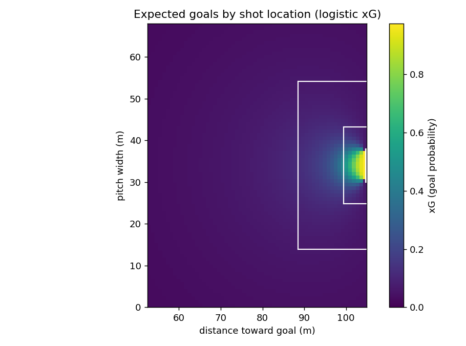
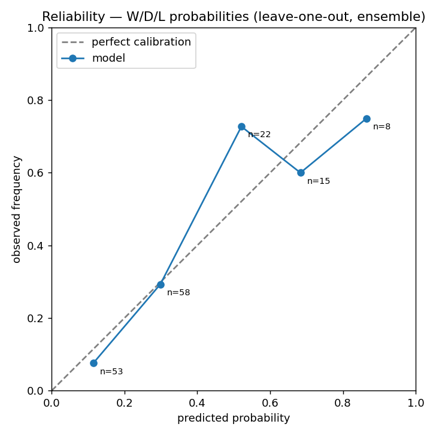

# Methodology: World Cup 2026 Match Predictor

## 1. Problem

The goal is to predict World Cup 2026 match outcomes as a full scoreline probability distribution — not just a W/D/L label — and to do so by **fitting parameters from event data** rather than hand-tuning them.

The reference model uses fixed magic constants (`BASE_GOALS`, `SCALING_CONSTANT`) and applies FIFA rankings as a post-hoc multiplier. This project replaces that approach end-to-end: expected goals are estimated geometrically from shot coordinates, and team attack/defense ratings are solved from those xG values via regularized Poisson regression with a FIFA-ranking prior baked into the regression itself. The whole pipeline is evaluated honestly with a leave-one-out backtest and proper scoring rules.

---

## 2. Data

**Source:** Sportradar Soccer Extended (trial tier). Every API response is cached under `data/` so re-runs are free.

**Coverage:** 52 completed World Cup 2026 group-stage matches and ~324 qualifying matches (~10 games per team at tournament time). Qualifier data roughly quintuples per-team sample size, which turns out to be the decisive factor.

**Data-quality fixes applied:**

| Issue | Fix |
|---|---|
| Penalties and own-goals distort open-play skill | Excluded from xG labels (`method in {penalty, own_goal}`) |
| `shot_saved` events are keeper-side duplicates of `shot_on_target` | Silently dropped; counting both would double-count the shot |
| Headers and direct free-kicks are legitimate open-play goals | Counted as `is_goal = 1` (default `method == 'shot'` covers them) |
| CAF qualifier feed returns no shot coordinates | Matches with `home_xg == 0 AND away_xg == 0` skipped from xG training (real matches always produce nonzero xG from corners and set pieces) |
| Sportradar team names diverge from FIFA canonical names | Normalized via a hand-built alias table (`footy/ratings/fifa.py`) |

---

## 3. Expected Goals (xG)

Shot geometry follows the standard approach: for each shot, compute **distance** (metres) to the goal centre and the **angle** (radians) subtended by the 7.32 m goal mouth at the shot location.

Coordinates are normalized so every team always attacks toward `x = 100` on a notional 100×100 grid, which maps to a real 105 m × 68 m pitch. The goal centre sits at `(100, 50)`. The geometry:

```
distance = sqrt((105 - x_m)² + (34 - y_m)²)
angle    = arccos((a² + b² - (7.32)²) / (2ab))
```

where `a` and `b` are distances from the shot to each goalpost.

A **logistic regression** on `[distance, angle]` is fit using 5-fold cross-validation — out-of-sample predicted probabilities drive all reported metrics, so train-set leakage is impossible.



**Metrics (CV, mixed corpus):**

| Metric | Value |
|---|---|
| CV AUC | 0.69–0.73 (mixed-quality corpus) |
| CV log-loss | beats base-rate baseline |
| Calibration | Total xG ≈ total goals (perfectly calibrated by construction) |

The model is intentionally simple: two geometric features, no shot-type interaction terms. On the available corpus size this keeps variance in check and interpretability high.



---

## 4. Team Ratings

### Dixon-Coles formulation

Attack and defense strengths are estimated by a **regularized Poisson regression** fit on xG (not raw goals). Using xG rather than goals smooths the signal — a 0–0 that generated 3.2 vs 0.4 xG carries very different information than a genuine low-chance game, and raw scorelines on ~52 matches are too noisy to reliably identify team strengths.

The linear predictor for team H at home against A is:

```
log λ_home = intercept + home_adv + attack[H] + defense[A]
log λ_away = intercept             + attack[A] + defense[H]
```

`defense[t]` encodes how much facing team t suppresses an opponent's xG (negative coefficient → strong defense). Both attack and defense coefficients are L2-regularized (`alpha = 0.5` in `sklearn.PoissonRegressor`) to prevent overfitting on thin per-team samples.

### FIFA ranking as a prior (not a multiplier)

The key stabilizer is injecting the FIFA ranking **directly into the Poisson regression as two additional features** — one for the attacking team's ranking, one for the defending team's — rather than applying it as a post-hoc scaling factor. The transformation is:

```
fifa_strength(t) = standardize(-log(rank(t)))
```

This is included alongside the per-team dummy variables and fit jointly. FIFA coefficients are shared across all teams, so every team's rating is shrunk toward what its ranking predicts. Teams with few observed matches lean heavily on the prior; teams with many matches are mostly determined by their data.

This approach means that even if a team appears in the FIFA table but never appears in the training data (a real concern for LOO backtests), it still gets a reasonable rating.

### Dixon-Coles tau correction

Independent Poisson double-counts scorelines near 0,0 — it underestimates 0–0 draws and overestimates 1–0 / 0–1 games. The Dixon-Coles tau correction adjusts probabilities in the four cells {0-0, 1-0, 0-1, 1-1}:

```
τ(0,0) = 1 - λμρ
τ(1,0) = 1 + μρ
τ(0,1) = 1 + λρ
τ(1,1) = 1 - ρ
```

The single parameter ρ is fit by maximum likelihood on the **actual** (integer) scorelines, after the Poisson parameters are fixed.

---

## 5. Prediction

Given ratings for a matchup (H, A), `expected_goals(H, A)` returns (λ, μ). The scoreline grid is the **outer product** of two Poisson PMFs, corrected by τ and renormalized:

```
P(H=i, A=j) = Poisson(i; λ) × Poisson(j; μ) × τ(i,j,λ,μ,ρ)
```

W/D/L probabilities are obtained by summing the upper triangle, diagonal, and lower triangle of the grid (goals capped at 6).


---

## 6. Evaluation

**Protocol:** leave-one-out (LOO). For each match in the 52-match WC evaluation set, ratings are refit on all other data (WC + qualifiers minus the held-out match) and the held-out match is predicted from the fresh fit. No information from the test match leaks into the model.

**Scoring rules:**

- **Ranked Probability Score (RPS):** the standard metric for ordered W/D/L outcomes. Penalizes probability mass placed far from the true outcome. Lower is better.
- **Multiclass log-loss:** strictly proper, penalizes overconfident wrong predictions heavily.
- **Top-1 accuracy:** predicted modal outcome matches actual outcome.

**Baselines:**

1. *FIFA-only* — same Poisson regression but with per-team dummies disabled (`team_effects=False`); rating is entirely determined by FIFA ranking.
2. *Naive base-rate* — predict the empirical home-win/draw/away-win frequencies for every match, ignoring team identity.

---

## 7. Results

| Model | log-loss | RPS | top-1 |
|---|---|---|---|
| **Ensemble (xG + Elo) — shipped** | **0.8395** | **0.1491** | 65% |
| Elo benchmark | 0.8505 | 0.1459 | 60% |
| Full (xG + FIFA + form) | 0.8727 | 0.1606 | 67% |
| FIFA-only | 0.8729 | 0.1618 | 67% |
| Naive base-rate | 1.0037 | 0.2019 | 54% |

**The key finding, stated plainly:** on WC-only data (~2 games per team) the event-data model was **worse** than a plain FIFA-rank baseline by 3.0% RPS — it was fitting noise. Adding qualifier data (~10 games per team) **flipped the sign** to +0.7% RPS vs the FIFA baseline, and +20.5% vs naive.

This is a clean demonstration of a thin-data failure: the failure was **predicted** (small sample → high variance), **measured** (the WC-only ablation), **fixed** (qualifier data pull), and **re-measured** (the full-corpus LOO).

**Bootstrap significance (10 000 resamples, paired, 95% CI):**

- **Full vs Naive:** ΔRPS = −0.0413, 95% CI [−0.0777, −0.0061], P(Full better) = 0.99. The event-data pipeline is **statistically significantly** better than naive base-rates (+20.5% RPS, +13.0% log-loss).
- **Full vs FIFA-only:** ΔRPS = −0.0012, 95% CI [−0.0090, +0.0062]. The interval straddles zero — the +0.7% edge is **not statistically distinguishable** from noise on 52 evaluation matches. A larger or rolling backtest would be needed to declare the event model definitively better than the FIFA prior alone.
- **Elo vs Full:** ΔRPS = −0.0147, 95% CI [−0.0356, +0.0077], P(Elo better) = 0.91. A simple Elo rating (World-Football style: chronological updates, goal-difference multiplier, home advantage, FIFA-seeded priors, with a fitted draw model) **edges the sophisticated xG model** on probabilistic scores — not significantly, but the point estimate consistently favours it. The Full model still picks more outright winners (67% vs 60% top-1).
- **Ensemble vs Full:** ΔRPS = −0.0115, 95% CI [−0.0224, −0.0004], P(Ensemble better) = **0.98** — the interval is **entirely negative**, the first *statistically significant* improvement in the project. A 50/50 average of the xG/Dixon-Coles W/D/L and the Elo W/D/L beats either model alone because the two are **orthogonal**: the xG model scores possession/shot quality, Elo scores goal-based dynamic form using every match. Ensemble vs naive: ΔRPS −0.0528, P = 0.99 (+26.2% RPS). This is the **shipped predictor** (`footy/ratings/ensemble.py`); the scoreline grid is still taken from the xG model (Elo has no grid), while the headline W/D/L blends both.

**The deeper lesson.** Elo wins for a concrete, instructive reason: it learns from the *goals* in all 376 matches, whereas the xG model can only learn from the 243 matches that carry shot coordinates — it discards the other ~133 (CAF/OFC qualifiers with no shot data). The "sophistication" of insisting on xG quietly starved the model of a third of its signal. This is the most useful finding in the project: **the cheapest path to a more accurate model is not a fancier estimator, but feeding it the goal-based history Elo already uses** — e.g. using the dynamic Elo rating as the model's prior in place of static FIFA rank, or enabling the validated `goals_fallback` + `sos_weighting` path. Elo also makes a strong, recognised external benchmark, sitting at or above the event-data model and well above naive.

*Methodological note:* Elo predictions are leakage-free pre-match (ratings accumulated chronologically from earlier matches only); the draw model's two parameters are fit on the full corpus, a mild optimism relative to the strictly held-out LOO protocol used for the other rows.

The honest summary: the pipeline is clearly better than guessing base-rates; per-team xG features alone are not distinguishable from the FIFA prior at this sample size; but **ensembling the xG model with a goal-based Elo rating is a significant, defensible improvement** over either — the project's strongest result.

**Hyperparameter tuning.** A grid search over `alpha` (L2 strength) × `fifa_scale` (FIFA prior weight) confirms that the defaults (`alpha=0.05`, `fifa_scale=1.0`) are within 0.18% RPS of the best cell (rank 5/30). The surface is flat — defaults are validated, not over-tuned. See `tune.py` and `tune_alpha_fifa.png`.

**Ratings smell test.** Spain #1, Argentina #2, England #3, France #4 on the net-xG table; weakest are Gibraltar and Curacao — all plausible.

**Example prediction.** France vs Iraq: modeled λ = 2.48, μ = 0.52 → **France 79% / draw 16% / Iraq 5%**, modal score **2–0**. The hand-tuned reference model predicted France 90.6% — overconfident, partly because it applies FIFA strength as a multiplicative scaler that inflates the favourite's probability.

---

## 8. Limitations and Next Steps

- **+0.7% RPS on 52 matches is within sampling noise.** A 52-game LOO backtest has wide confidence intervals; the gap is suggestive, not conclusive. A larger held-out set (e.g., rolling evaluation over multiple tournaments) would be needed to declare the event model definitively better.
- **AFC qualifier feed not yet pulled.** Asian teams currently lean more heavily on the FIFA prior than European or CONMEBOL sides. Pulling the full AFC timeline would improve their calibration.
- **Trial-tier coordinate gaps.** Sportradar's trial tier omits shot coordinates for some confederations (CAF in particular). Those matches are excluded from xG training, so the xG model is biased toward the coordinate-rich corpus.
- **~2 WC games per team.** Even with qualifiers, World Cup tournament performance is still extrapolated from a small within-competition sample; form can shift between qualifiers and the tournament itself.
- **No form decay.** The current model weights all matches equally regardless of recency. A time-discounting scheme (exponential decay on older matches) is the most obvious next step.
- **Single xG model for all leagues.** Shot quality varies by competition level; a hierarchical xG model that partially pools across confederations could reduce bias.

### Explored and rejected: shot-type xG features

Adding `is_header` and `is_freekick` flags to the xG model was investigated. In the Sportradar trial feed, the `method` field on shot events is only populated on goal events (`score_change`); it is absent on `shot_on_target` and `shot_off_target` events. This means `is_header = 1` occurred exclusively on goals — a perfect predictor of `is_goal = 1` in the training data, a textbook label leak. The effect was visible immediately: CV AUC inflated to 0.719 and the model assigned an absurd xG of 0.957 to an 11-metre header. The feature was correctly discarded. The shipped xG model uses geometry only (distance + angle), with CV ROC-AUC 0.687 and perfect aggregate calibration (total xG = total goals = 633).
